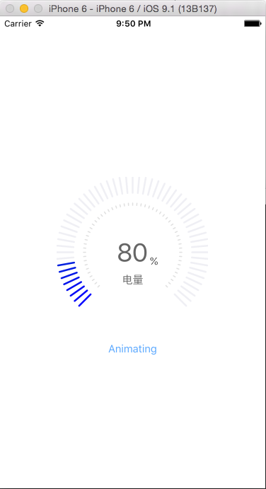
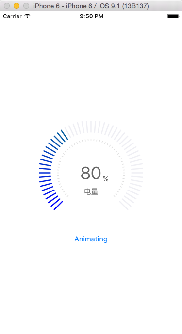
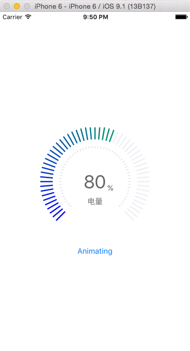
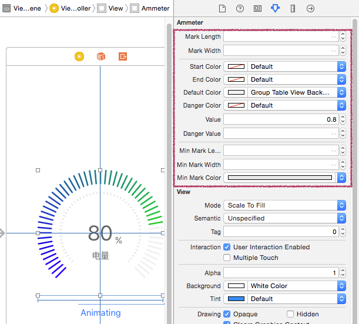

#Ammeter 仪表板控件

一个仪表盘控件，以动画方式显示指定百分比值，比如电量表、油量表等。



##用法
将如下文件导入到您的项目中：

* UIColor+Interpolate.h/.m
* Dashboard.h/.m
* Ammeter.h/.m/.xib

在源文件中 import 头文件 Ammeter.h。

### 可视化设计

Ammeter 支持 IB 的可视化设计。在故事板中拖入一个 UIView，在属性面板中，设置其 Class 为 Ammeter。

在属性面板中，你可以通过如下属性定制 Ammeter 控件：



其中：

* Mark Length 和 Mark Width: 设置彩色（渐变色）刻度线的长度和线宽。
* Start Color 和 EndColor : 设置彩色刻度线的渐变色范围——起始颜色、终止颜色。
* Default Color : 设置空的刻度线的默认颜色（图中用于表示已用掉的电量）。
* Danger Color 和 Danger Value : 设置最低阀值和警告色，例如电量少于 10% 用红色表示，可以将 Danger Value 设置为 0.1，Danger Color 设置为红色。
* Value : 设置仪表盘的当前值，比如 0.8，表示当前电量（油量）还剩 80%。
* Min Mark Length、Min Mark Length 和 Min Mark Color : 设置小刻度线（中间一圈的刻度线）长度、线宽及颜色。

### 动画显示

Ammeter 支持将电量、油量以动画形式展示。你只需要调用 startAnimating 方法即可：

```
[ammeter startAnimating];
```

运行示例项目，点击 Animating 按钮，查看动画效果。

### 定制其它 subviews 

除了仪表盘（一个 Dashboard 对象），Ammeter 中还有一些文字显示(3 个 UILabel)，你也可以通过代码方式来定制它们。它们分别是:

* UILabel *lbPower 即截图中的 “电量”。
* UILabel *lbRemainder 即截图中的 “80”。
* UILabel *lbPercentSign 即截图中的 “%”。

### 示例程序

用 Xcode 打开 DashboardDemo.xcodeproj。支持 Xcode 6 - 7（Xcode 8.0 需要修改 Ammeter.m 中的 startAnimating 方法）。

有任何问题和建议，请与作者联系。